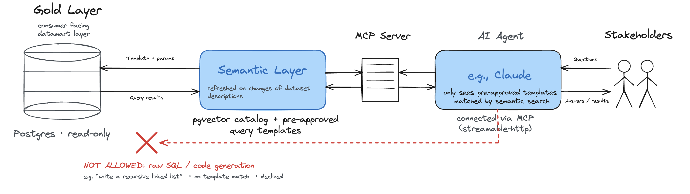
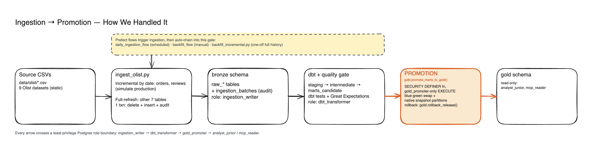

# Agentic Medallion Data Pipeline

Source dataset: https://www.kaggle.com/datasets/olistbr/brazilian-ecommerce

A fully containerized, local **Medallion (bronze → silver → gold)** data pipeline on PostgreSQL:
batch ingestion, dbt transforms, data-quality gating, blue-green schema promotion, a pgvector
semantic catalog, and a read-only **MCP server** that lets LLM agents query the gold layer safely.

> ⚠️ **Local demo, not hardened for network exposure.** Credentials live in `.env` (gitignored);
> the database binds to `127.0.0.1` only. The Postgres image uses `trust` auth for connections
> *inside* the container (image default) — fine locally, not a production setup.



Editable source: [`docs/diagrams/high_level_mcp_agent_flow_diagram.excalidraw`](docs/diagrams/high_level_mcp_agent_flow_diagram.excalidraw).

## Stack
PostgreSQL 16 + pgvector · dbt-core (postgres) · Prefect 3 · Great Expectations · FastMCP · Docker Compose

## What's built

- **Ingestion** — batch loads from the Olist CSVs into `bronze`, with incremental, full-refresh,
  and forced-replacement modes and a full audit trail. See [`pipeline/ingestion/README.md`](pipeline/ingestion/README.md).
- **Transformation** — dbt models flow `bronze → staging → intermediate → marts_candidate`,
  gated by dbt tests and Great Expectations before anything moves further. See
  [`dbt/README.md`](dbt/README.md) and [`pipeline/quality/README.md`](pipeline/quality/README.md).
- **Promotion** — a blue-green swap of validated candidates into `gold`, driven by a single
  least-privilege `SECURITY DEFINER` function, with an explicit release/rollback system and
  native date-partitioned snapshots for the two customer marts that need history. See
  [`pipeline/promotion/README.md`](pipeline/promotion/README.md).
- **Semantic catalog** — a pgvector-backed catalog of every gold table, column, and query
  template description, kept in sync with dbt's own docs via hash-based change detection. See
  [`pipeline/catalog_sync/README.md`](pipeline/catalog_sync/README.md).
- **MCP server** — a hardened, read-only MCP server (`mcp-server`) that lets an LLM agent search
  that catalog and run pre-approved, parameterized query templates against `gold` — never raw
  SQL. See [`mcp_agent/README.md`](mcp_agent/README.md) for the design rationale.

Everything above `gold` (staging/intermediate/marts_candidate) is working state; only `gold` is
what read-only consumers (`analyst_junior`, `mcp_reader`) can query.



Editable source (Excalidraw): [`docs/diagrams/ingestion_and_promotion.excalidraw`](docs/diagrams/ingestion_and_promotion.excalidraw).
More diagrams: gold-layer ER detail ([`gold_data_model.excalidraw`](docs/diagrams/gold_data_model.excalidraw)) and
the full per-layer model map ([`medallion_layers_full.excalidraw`](docs/diagrams/medallion_layers_full.excalidraw)).

Known gaps found via adversarial code review, not yet fixed: see [`FUTURE_IMPROVEMENTS.md`](FUTURE_IMPROVEMENTS.md).

## Example business questions this answers

Every question below maps to a real, parameterized query template under `mcp_agent/templates/`,
discoverable by an agent via semantic search (`search_semantic_catalog`) and executed read-only
against `gold` (`run_supported_query`) — these were run for real against the live data, not
hypothetical.

| Business question | Template |
|---|---|
| Which states generate the most GMV? | `top_n_by_metric` |
| How has GMV trended month over month? | `metric_over_time` |
| What's this customer's full order history and lifetime value? | `customer_order_history_lookup` |
| Who are our biggest customers by lifetime value? | `top_customers_by_lifetime_value` |
| Which high-value customers have gone quiet? | `quiet_key_accounts` |
| What does this customer's full profile look like — location history, order activity, category interests? | `customer_360_lookup` |
| What does this seller's overall performance look like — GMV, freight ratio, review score? | `seller_performance_lookup` |
| Which sellers have the best/worst average review scores? | `top_sellers_by_metric` |
| Which of our best sellers have gone quiet? | `quiet_key_sellers` |
| Which product categories generate the most merchandise value? | `top_categories_by_metric` |
| How concentrated is our GMV among our top sellers? | `seller_revenue_concentration` |

Two grain fixes worth calling out, both found by checking real data rather than assuming the
obvious column was the right key:

- **`customer_id` is order-specific**, not person-specific — a repeat Olist customer gets a new
  `customer_id` per order. Every customer-level metric here groups by `customer_unique_id`, the
  stable person-level key. Verified: 99,441 `customer_id` rows collapse to 96,096 real customers.
- **A seller's average review score can't be honestly computed from every one of their orders** —
  reviews are attached to the order, not to a specific seller, so a multi-seller order's review
  can't be attributed to just one of them. `seller_performance_lookup` restricts
  `avg_review_score` to single-seller orders and reports the exact denominator
  (`reviewed_single_seller_order_count`) alongside it, for transparency.

## Development process

Built solo, with heavy use of AI coding agents doing the implementation — Claude and Codex
worked on different parts of the pipeline and were also turned on each other for adversarial
code review (one reviewing and pressure-testing the other's changes) before anything got merged.
That caught real bugs before they shipped, not just style nits — e.g. a fan-out double-counting
bug in a seller's average review score, and an `as_of_date` default that would have silently made
every recency-based metric wrong once run outside of this frozen 2017 dataset's own time window.

### Database Initialization

Load environment variables from `.env`:

```bash
set -a && source .env && set +a
```

If you need to run a specific new script once initialization was already done, this is an example of how to do it, assuming you have loaded environment variables.

```
docker compose exec -T postgres psql -U "$POSTGRES_USER" -d "$POSTGRES_DB" < postgres/init/020_bronze_tables.sql
```

Validation of tables creation

```
docker compose exec postgres psql -U "$POSTGRES_USER" -d "$POSTGRES_DB" -c "\dt bronze.*"
```

Inspect the raw_orders table:

```
docker compose exec postgres psql -U "$POSTGRES_USER" -d "$POSTGRES_DB" -c "\d bronze.raw_orders"
```
